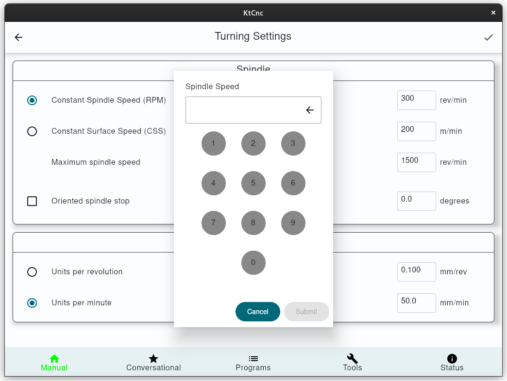
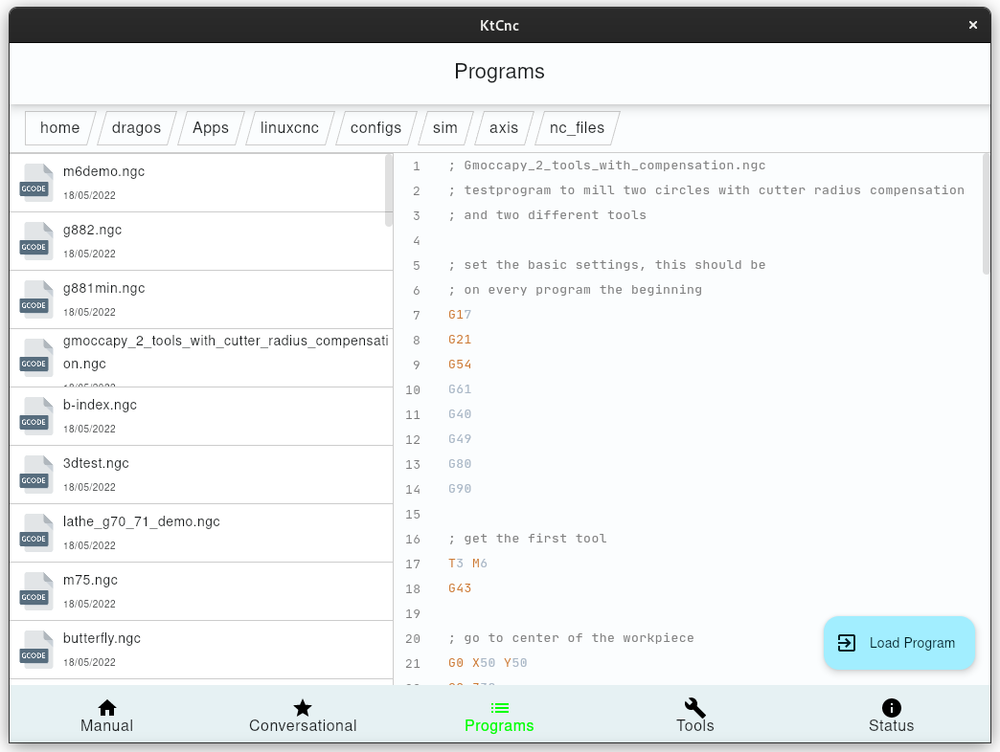
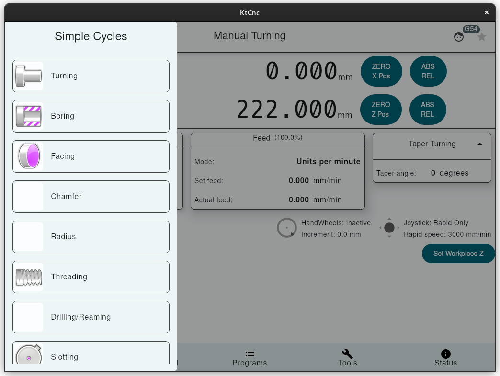
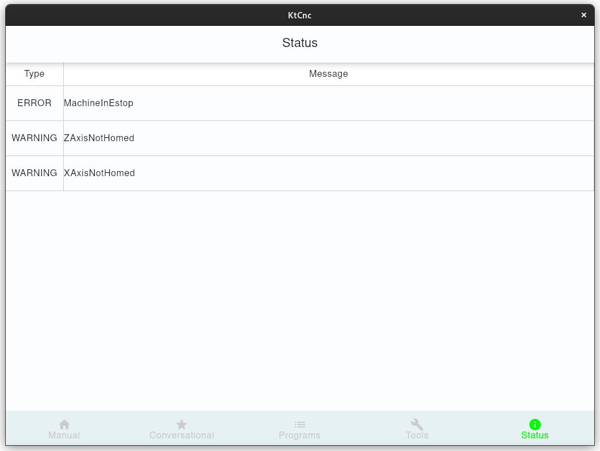
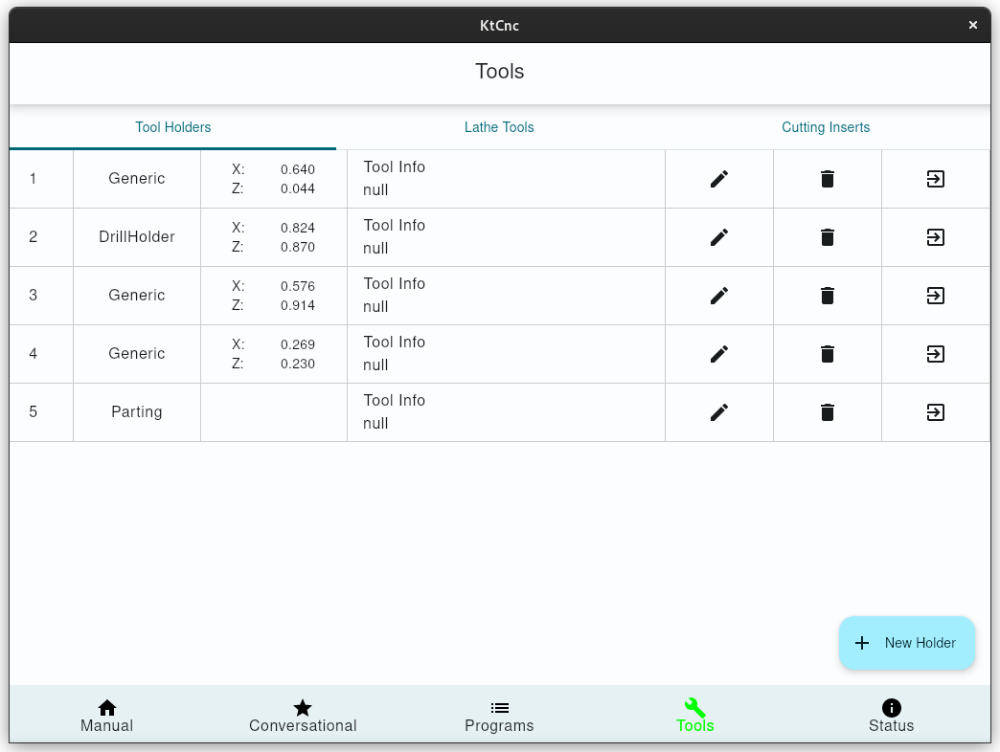
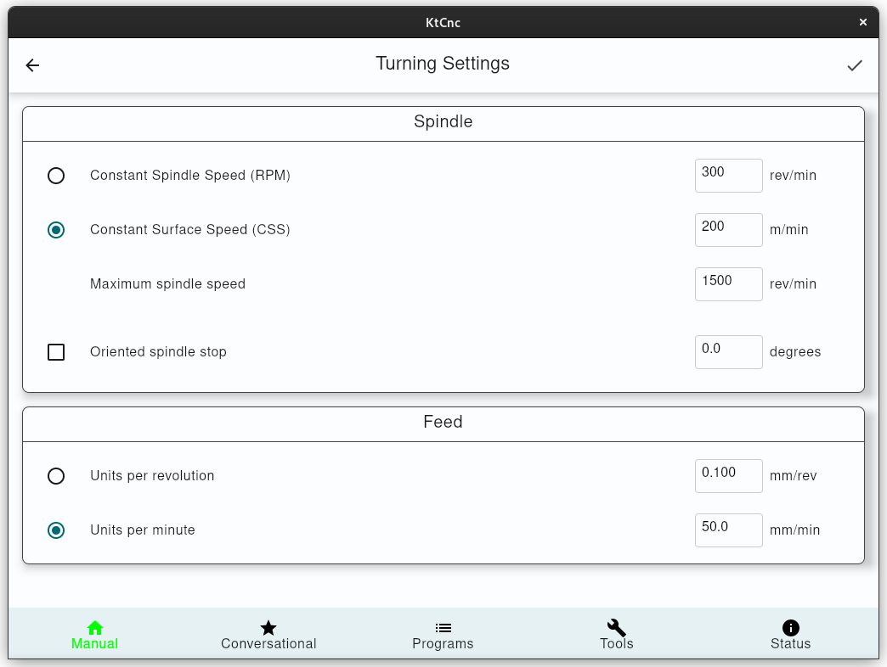

# JCNCScreen

## Features

* _JCNCScreen_ is a frontend application for [linuxcnc](http://linuxcnc.org) which
  is published according to GPL 2.0 or later. See file COPYING for details.

* _JCNCScreen_ contains a tool-manager with plugins for exporting tooltables for
  different applications. These Plugins are separate projects.

* _JCNCScreen_ supports up to 9 axis. Screen controls reflect settings from
  linuxcnc inifile.

* _JCNCScreen_ is build with java-language and swing for gui, so building and
  installing might be different to usual linux packages.

* Running _JCNCScreen_ might be different for java applications, as linuxcnc
  uses shared memory buffers for communication. So _JCNCScreen_ contains a
  little C-stub that handles all shared memory access. That stub needs to be
  loaded by the java runtime, so starting _JCNCScreen_ needs special parameters.

## Screenshots

[](preview/numpad.png)

[](preview/programs.png)

[](preview/simple_cycles.png)

[](preview/status.png)

[](preview/tools_holders.png)

[](preview/turning_settings.png)

## Build

TODO

## Run the app

Run using gradle(you need to specify an ini file to run):

```shell
./gradlew run --args="configs/sim/axis/lathe.ini"
```

Other arguments:

| command | description                |
|---------|----------------------------|
| tb      | disable system top app bar |
| v       | disable vtk                |

## Usage

TODO

